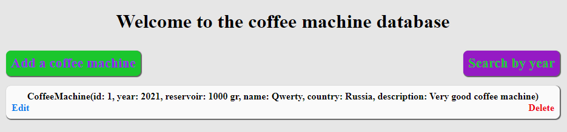
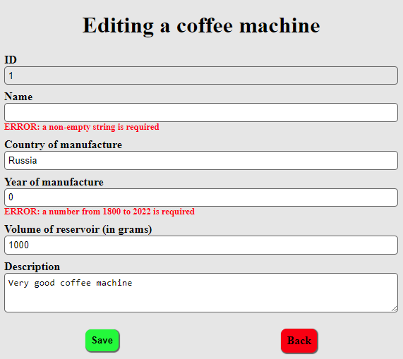

# Практическая работа №6
### Замолоцкий Семен, КИ20-17/1Б
Для 5 варианта задана сущность - кофемашина.  

Для сборки и запуска серверного web-приложения с помощью Gradle ввести
`gradlew.bat jettyRunWar` в cmd или `./gradlew jettyRunWar` в bash. При
первом запуске возможна установка плагинов Gradle. После появления INFO
сообщений *runs at: http://localhost:8080/*, можно в браузере перейти
по указанному адресу или отправить запрос через клиентское приложение.
Для остановки нажать Enter.

Для сборки и запуска клиентского приложения с помощью Gradle ввести
`gradlew.bat run -q --console=plain` в cmd или
`./gradlew run -q --console=plain` в bash. В консольном интерфейсе
доступно 5 действий: CREATE, READ, UPDATE, DELETE, READ ALL.

На главной странице можно перейти к форме добавления или к поиску
по минимальному году. После добавления объектов, будет доступны
удаление и изменение. При добавлении/изменение действуют ограничения:
поле name не должно быть пустым, значение year должно лежать в
диапазоне от 1800 до 2022. При нарушении появятся сообщения.

**Название БД должно быть coffee_machines.**  
Для создания таблицы с несколькими тестовыми записями, можно запустить
скрипт create_tables.sql (например, с помощью утилиты sqlite:
`sqlite3 coffee_machines.db -init create_tables.sql .exit`).

#### Примеры
  
